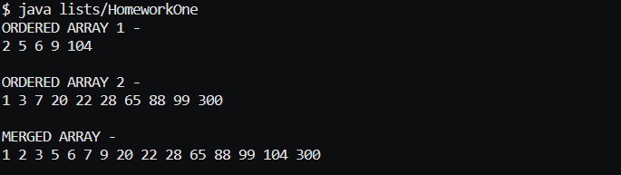

# CIRCULAR LINKED LIST PROGRAMMING ASSIGNMENT

## ASSIGNMENT DIRECTIONS
A circular list is a linked list in which the last node points back to the first node.

Make a class for a singly linked circular list that has no end and no beginning.

The only access to the list is a single reference (current) that can point to any node in the list.

You should also be able to display the list. 

The circular list should have a step() method that moves current along to the next link.

## COMPLETION SCREENSHOT

