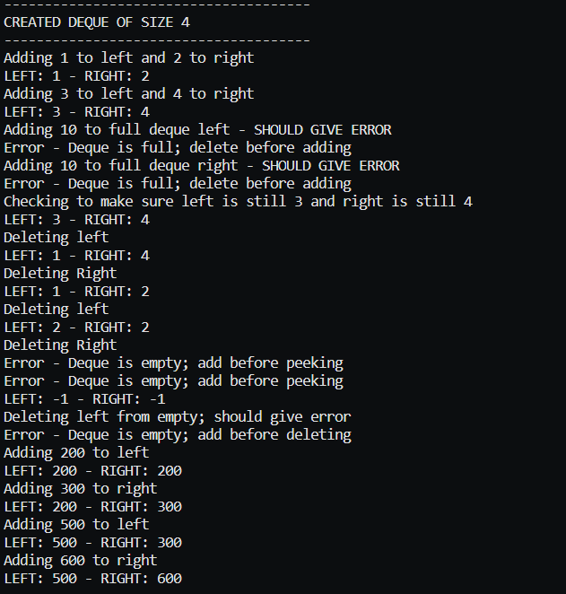
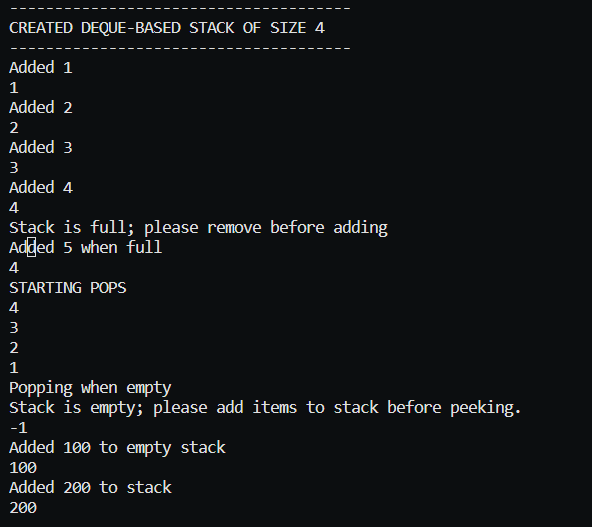

# STACK / QUEUE PROGRAMMING ASSIGNMENT

## ASSIGNMENT DIRECTIONS
Create a Deque class based on the discussion of deques in this chapter. It should include insertLeft(), insertRight(), deleteLeft(), deleteRight(), isEmpty() and isFull() methods. It will need to support wrapping around at the end of the arrays as queues do.

After you have created the Deque class, write a Stack class based on the Deque class(Use deque class methods). This Stack class should have the same methods and capabilities as the Stack we implemented in class.

Write a main class that tests both Deque and Stack classes.

## COMPLETION SCREENSHOT

#### Testing Deque Class

