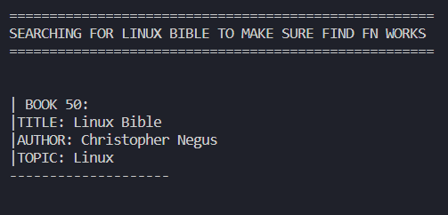

# SEPARATE CHAINING HASHTABLE PROGRAMMING ASSIGNMENT

The hashtable is a data structure that allows for constant insert and deletion. It takes a key and hashes it into an array index. Because of this, however, collisions can occur and how you handle the collisions has a big impact on time and space complexity.

Separate chaining is a collision method where each array index has another data structure (in the case of this assignment, a binary search tree). This means that when collisions occur, the new item can then be added to the data structure (instead of needing to do linear or quadratic probing). 

## ASSIGNMENT DIRECTIONS

Program a hashtable that implements separate chaining using binary search trees:

☑ Insertion of an object into the table

☑ Deletion of an object from the table

☑ Search for an object in the table

Please do not use in-built data structures from the library.

## COMPLETION SCREENSHOT

