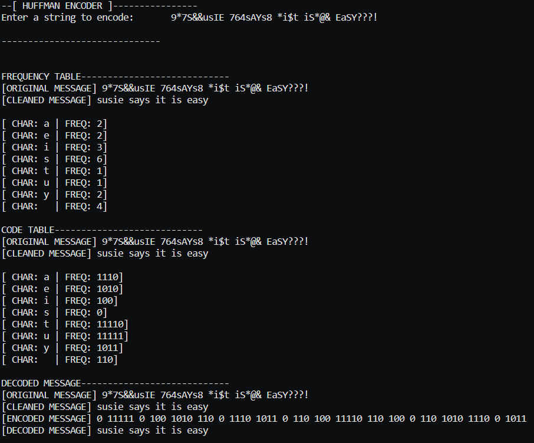

# HUFFMAN TREE PROGRAMMING ASSIGNMENT

Huffman encoding seeks to compress data into binary for quicker transmission. It accounts for the fact that different data will have different characters be more common and tries to give the most common characters the smallest binary sequences.

This Huffman encoding was doing using a Priority Queue implemented with array-based MinHeap, a Binary Tree, and arrays for storage (since part of the assignment was avoiding the use of in-built data structures from the library).

## ASSIGNMENT DIRECTIONS

Write a program to implement Huffman encoding and decoding. It should do the following:

☑ Accept a text message.

☑ Create a Huffman tree for this message

☑ Create a code table

☑ Encode the message into binary

☑ Decode the message from binary back to text

You can use String variables to store binary numbers. Don't worry about the actual bit manipulation. Please do not use in-built data structures from the library.

## COMPLETION SCREENSHOT

