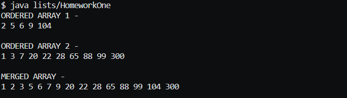

# ARRAY PROGRAMMING ASSIGNMENT

## ASSIGNMENT DIRECTIONS
Modify your Ordered List class to add another method called merge() to this class so that you can merge two source arrays into one destination ordered array. Write code in the `main()`` that inserts some random numbers into the two source arrays and then invokes the merge() method to display the contents of the resulting destination array. The source arrays should be able to hold different numbers of data items. Please do not use any in-built java classes like ArrayList or its methods.

## COMPLETION SCREENSHOT

