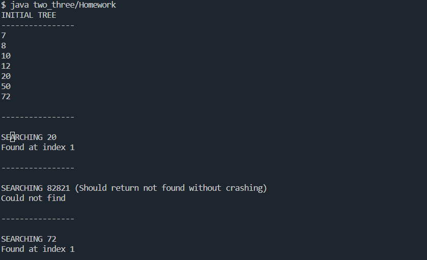

# TWO THREE TREE - EXTRA CREDIT PROGRAMMING ASSIGNMENT

Two Three Tree is another self-balanced tree. It's important to compare to the two-three-four tree to see just how much the algorithm changes when we remove one data item and one child.

## ASSIGNMENT DIRECTIONS

Write a two-three tree that is able to:

☑ Insert new items (and self-balance while doing it)

☑ Search for items

☑ Display the tree

Remember that two-three trees do not split on the way down. They must split when inserting because they only have two data items.

## COMPLETION SCREENSHOT

