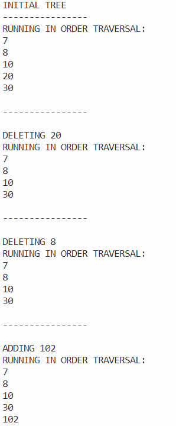

# TWO THREE FOUR TREE PROGRAMMING ASSIGNMENT

Two Three Four Tree is a self-balancing tree data structure that is easier to program than a Red Black tree. They aren't really in use these days. According to the professor, most programmers prefer to use a Trie data structure for this set of tasks.

## ASSIGNMENT DIRECTIONS

Use the Two Three Four tree provided and write the following:

☑ An in-order traversal method

☑ A method that marks nodes deleted (it does not have to actually implement deletion)

Please do not use in-built data structures from the library.

## COMPLETION SCREENSHOT

